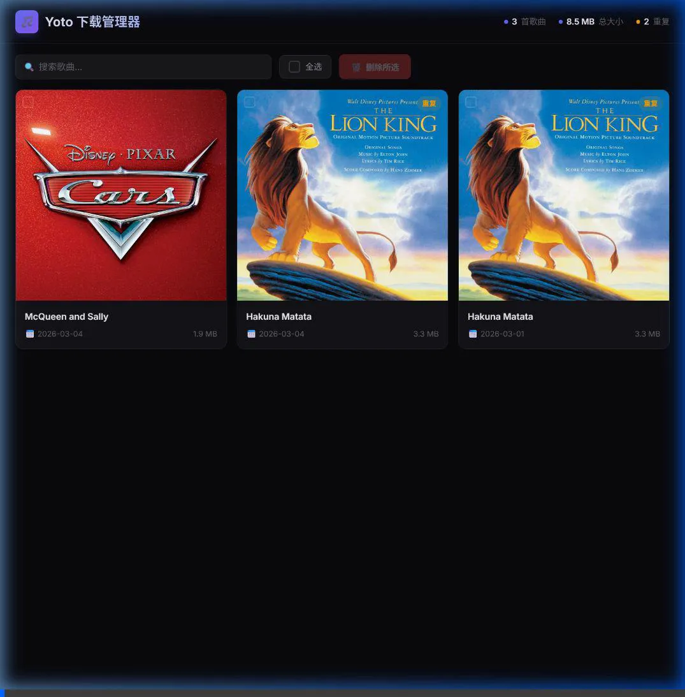

# 🎵 Yoto Downloader (Yoto 儿歌自动下载器)

一个支持自托管的自动化极客工具，专为 Yoto Player 自制卡片（Make Your Own）的音频及封面准备流程打造。🚀

## 🌟 为什么需要这个？ (痛点)

每一位家长都经历过这样的场景：孩子听到一首喜欢的歌，立刻问你：**“能把这个放到我的 Yoto 里吗？”** 然而，目前的常规流程充满了摩擦力：

1. **待办清单的烦恼**：你只能先把链接发给自己或配偶，想着“回家再弄”。
2. **繁琐的手动操作**：等你有空坐到电脑前，还要手动运行 `yt-dlp` 等命令行工具。
3. **封面裁切的挣扎**：你需要找到视频缩略图，下载下来，再用修图软件小心翼翼地裁成完美的正方形。
4. **延迟的满足感**：等你把这一切弄完，孩子可能已经去玩别的了，“魔法时刻”就这样错过了。

**Yoto Downloader** 将这个多步骤的家务活变成手机上只需 5 秒钟的顺滑操作。通过系统的“分享菜单”发送链接，剩下的全部交给你的 NAS 去处理。👶🎶

## 🧱 系统组件

要让这套工作流跑起来，你需要以下几个“零件”：

1. **一台服务器 (NAS 或 PC)**：一台常亮、运行 Docker 的机器，用于托管 Web API 服务端。
2. **文件访问 (SMB/共享文件夹)**：NAS 上的一个共享文件夹，用于存储下载的音频和图片。这能让你的 iPhone 通过“文件”App 直接“看”到这些资源。
3. **装有“快捷指令”App 的 iPhone**：连接 YouTube 和你私有服务器的桥梁。

## ✨ 功能特性

* **⚡ 极速响应 (FastAPI)**：接收到请求后立即返回 HTTP 200，避免 iOS 快捷指令因等待下载而发生超时报错。
* **🎧 优化的音频提取**：使用 `yt-dlp` 提取最佳音频流并保存为 `.m4a` 格式，拒绝二次转码带来的无谓损耗。
* **🖼️ 自动正方形裁剪**：调用 `Pillow` 库，自动将视频原始封面居中裁剪为 1:1 的正方形 (`_square.jpg`)，以完美符合 Yoto 播放列表的图标规范。
* **🤖 突破反爬虫限制**：Docker 镜像内嵌 `Deno` 运行环境，完美解析 YouTube 最新的 JS 混淆与 Signature 验证。
* **📂 按月归档**：下载的文件自动按月份分类存入 `/audio/YYYY-MM/` 和 `/covers/YYYY-MM/` 目录中。
* **📦 一键归档**：加到 Yoto 卡片后，一键将所有歌曲移入扁平的 `/archive/` 目录，保持月目录干净。
* **🔔 Discord 通知**：任务处理完成后，通过 Webhook 发送包含状态信息的通知。✅
* **🛡️ 完美解决 NAS 权限**：支持通过 `PUID` 和 `PGID` 环境变量运行，确保生成的音频和图片文件拥有正确的所属权，SMB 管理毫无障碍。
* **🖥️ 可视化管理面板**：内置歌曲管理界面，支持浏览、搜索和批量删除已下载的歌曲。

## 🖥️ 可视化管理面板

访问内置管理面板：`http://<你的 NAS 局域网 IP>:8000/`



**功能一览：**

- **统一视图**：在一个页面中浏览所有日期下载的歌曲和封面
- **重复检测**：同名歌曲出现在不同日期时，会自动标注 "重复" 标签
- **搜索过滤**：按标题即时搜索，统计信息实时更新
- **批量管理**：点击卡片或使用 "全选" 进行多选，一键批量删除并弹出确认对话框
- **一键归档**：歌曲加到 Yoto 卡片后，点击「一键归档全部」移入 archive 目录
- **封面预览**：每首歌曲均展示自动裁剪后的正方形封面

## 🚀 部署指南

### 1. 环境配置

克隆仓库并复制环境配置模板：

```bash
cp .env_example .env

```

修改 `.env` 配置文件（参考 `.env_example`）。请务必确保 `PUID` 和 `PGID` 与你的 NAS 常用用户匹配，以避免 SMB 访问时的权限问题。

### 2. 启动服务

```bash
docker-compose up -d

```

## 📱 iOS 快捷指令配置

1. 设置快捷指令在 **共享表单中显示**（接收类型：*URL* 和 *文章/文本*）。
2. 添加操作：**获取输入中的 URL (Get URLs from Input)**。（这一步非常关键，它能将 YouTube 夹杂着文字的分享内容洗得只剩纯净链接）。
3. 添加操作：**获取 URL 内容 (Get contents of URL)**。
4. 配置参数：
* URL: `http://<你的 NAS 局域网 IP>:8000/download`
* 方法: `POST`
* 请求体: `JSON`
* 字段: 添加新字段 -> 文本 -> 键: `url` -> 值: 选择上方步骤拿到的 **“输入中的 URL”**。


## 📁 目录结构预览

```text
/downloads
  ├── audio/
  │   └── 2026-03/
  │       └── The Wheels on the Bus.m4a
  ├── covers/
  │   └── 2026-03/
  │       ├── The Wheels on the Bus.webp         # 原始缩略图
  │       └── The Wheels on the Bus_square.jpg   # 裁剪后的正方形封面 (随时可传至 Yoto)
  └── archive/                                   # 一键归档后
      ├── audio/
      │   └── The Wheels on the Bus.m4a
      └── covers/
          └── The Wheels on the Bus_square.jpg
```
